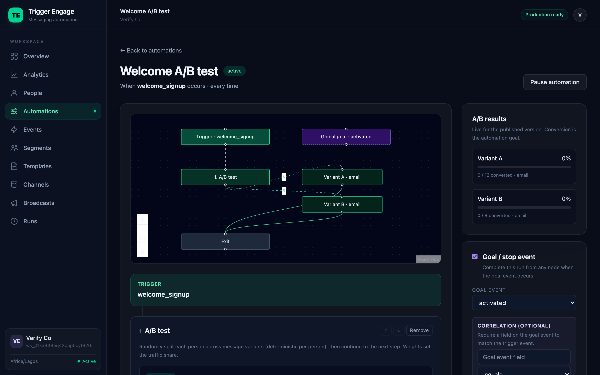

# Trigger Engage

**Open-source, self-hostable event-based messaging automation for Laravel.** Fire
events from your app, build drag-and-drop journeys in a visual editor, and let the
engine deliver email, SMS, and push — with segments, A/B tests, and analytics built in.

Trigger Engage is a cost-free alternative to hosted lifecycle-messaging platforms like
Customer.io. Run it as a standalone service, or install the entire dashboard and engine
**inside your existing Laravel app** with one Composer command — no second service, no
per-profile bill.

> Built for [Mytherapist.ng](https://mytherapist.ng) and released to everyone. Read the
> [origin story](server/docs/marketing/why.md).

```php
// From anywhere in your app — fire-and-forget, never throws:
TriggerEngage::identify('user-42', ['email' => $user->email, 'first_name' => 'Ada']);
TriggerEngage::event('customer_sign_up', ['plan' => 'free'], person: 'user-42');
// …a published journey does the rest: wait, branch, A/B test, and send.
```

<p align="center">
  
  <br><em>The visual journey builder — here an A/B test with live per-variant results.</em>
</p>

---

## Why Trigger Engage

- **Own your data and your bill.** Self-host it, or bundle it into your Laravel monolith.
  No per-profile pricing, no vendor lock-in, MIT licensed.
- **Multi-channel from day one.** Email (SMTP/ZeptoMail/SES/Mailgun/Postmark), SMS (Termii),
  and push (OneSignal) behind one journey engine and one customer profile.
- **A real automation engine, not a cron.** Versioned journeys, durable multi-day delays,
  wait-for-event, goals, branching, and **A/B splits** — with hard guarantees against
  double-sends and lost events.
- **Fail-open by design.** The SDK never throws into your app code. A messaging outage can
  never break your signup or checkout.
- **Batteries included.** Visual journey builder, behavioural segments, one-time broadcasts,
  a branded email composer with live preview, deliverability webhooks, and a time-series
  analytics dashboard.

## Features

| Area | What you get |
|---|---|
| **Ingestion** | `identify` / `track` / properties / batch-backfill API + fail-open Laravel SDK with a test fake |
| **Journeys** | Versioned visual graphs: trigger → delay · branch · wait-for-event · **A/B split** · send · goal · exit |
| **Channels** | Email (SMTP/ZeptoMail/SES/Mailgun/Postmark), SMS (Termii), push (OneSignal) |
| **Segments** | Manual, event-driven, and **rule-based** behavioural audiences that recompute themselves |
| **A/B testing** | Weighted, deterministic message splits with live per-variant conversion results |
| **Identity** | **Anonymous → identified merge**: track pre-signup, stitch the history on identify |
| **Content** | Branded email composer (WYSIWYG + HTML/Liquid), exact live preview, per-template design |
| **Broadcasts** | One-time email/SMS/push campaigns to a point-in-time segment snapshot |
| **Analytics** | Time-series volume, delivery funnel, per-channel breakdown, and period deltas |
| **Ops** | Horizon queues, durable scheduler tick, Docker Compose stack, GDPR/NDPR erasure |

## How it fits together

```
┌────────────────────┐   identify / track     ┌──────────────────────────────┐
│  Your application   │ ─────────────────────▶ │        Trigger Engage         │
│  (Laravel + SDK)    │   HTTP  or  in-process  │                               │
└────────────────────┘                         │  Ingestion API → Engine       │
                                               │    · matcher (re-entry)       │
   ┌───────────────┐   deliver                 │    · run graph (delay/branch/ │
   │ Email · SMS · │ ◀──────────────────────── │      wait/split/goal/send)    │
   │ Push provider │                           │    · Horizon queues + tick    │
   └───────────────┘   webhooks (delivery)     │  Segments · Broadcasts · UI   │
        │  ────────────────────────────────▶   │  Analytics · Templates        │
        └──────────────────────────────────────└──────────────────────────────┘
```

Two ways to run it, from one codebase:

- **Embedded** — `composer require trigger-engage/server` inside your Laravel app. Uses your
  database, queue, scheduler, and auth. SDK calls dispatch in-process; no API credentials.
- **Self-hosted** — deploy as its own service and connect one or more apps over the SDK/API.

## Repository layout

| Path | What it is |
|---|---|
| [`server/`](server) | The platform — ingestion API, automation engine, and React/Inertia dashboard (Laravel 13) |
| [`laravel-sdk/`](laravel-sdk) | The `trigger-engage/laravel` client SDK — `identify` / `track`, fail-open, with a test fake |

## Quickstart

### Embed it in an existing Laravel app

```bash
composer require trigger-engage/server
php artisan engage:install --name="My Product" --timezone=Africa/Lagos
```

Open `/trigger-engage`. Then fire events from anywhere:

```php
use TriggerEngage\Laravel\Facades\TriggerEngage;

TriggerEngage::identify((string) $user->id, ['email' => $user->email]);
TriggerEngage::event('appointment_booked', ['appointment_id' => $id], person: (string) $user->id);
```

### Run it standalone

```bash
cd server
composer install && cp .env.example .env && php artisan key:generate
php artisan migrate --seed --seeder=DemoSeeder   # prints demo SDK credentials
php artisan serve                                # dashboard at http://localhost:8000/app
php artisan schedule:work                        # durable delays, timeouts, retries, segment recompute
```

Full instructions, including production deployment, are in the
[installation guide](server/docs/INSTALLATION.md).

## Documentation

Start at the **[documentation index](server/docs/README.md)**. Highlights:

- [Concepts](server/docs/CONCEPTS.md) — the mental model: workspaces, people, events, journeys, segments
- [Building journeys](server/docs/guides/automations.md) — every node type, with examples
- [Segments](server/docs/guides/segments.md) — manual, event-driven, and rule-based audiences
- [A/B testing](server/docs/guides/ab-testing.md) — weighted splits and reading the results
- [Anonymous → identified](server/docs/guides/anonymous-identity.md) — pre-signup tracking and merge
- [Analytics](server/docs/guides/analytics.md) — the metrics dashboard
- [HTTP API reference](server/docs/API.md) — every endpoint, payload, and error
- [Laravel SDK](laravel-sdk/README.md) — client usage and testing
- [Production deployment](server/README.md#deploying-the-backend) · [Production gates](server/PRODUCTION.md)
- [Architecture spec](server/SPEC.md) · [Changelog](CHANGELOG.md) · [Contributing](CONTRIBUTING.md)

## Project status

Actively developed and dogfooded at Mytherapist.ng. The engine core, channels, content
authoring, segments, broadcasts, A/B testing, anonymous identity, and analytics are shipped;
see the [changelog](CHANGELOG.md) for the current milestone and the
[spec roadmap](server/SPEC.md#9-roadmap) for what's next.

## License

MIT — see [LICENSE](server/LICENSE). Use it, host it, fork it.

## Contributing

Issues and pull requests are welcome. Please read [CONTRIBUTING.md](CONTRIBUTING.md) first —
it covers the dev setup, the test suite, and coding conventions.
