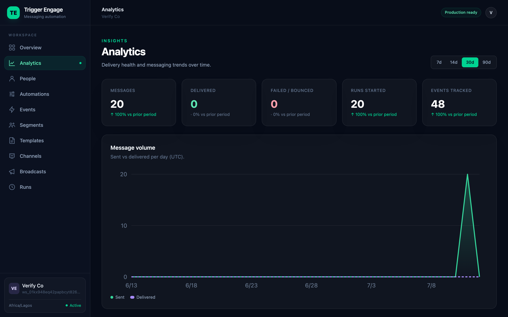

# Analytics

The **Analytics** dashboard is a read-only overview of how your workspace is
performing — messages sent, journeys started, events tracked, and how far your
messages get down the delivery funnel. It is a page, not an API.



## Opening analytics

Click **Analytics** in the dashboard sidebar, or go straight to the URL:

| Mode | Path |
|---|---|
| Self-hosted | `/app/analytics` |
| Embedded | `/trigger-engage/analytics` |

A range selector at the top picks the window. It reads a `days` query
parameter — `7`, `14`, `30`, or `90` (default `30`):

```
/app/analytics?days=90
```

## The numbers at a glance

A row of **stat tiles** sits across the top. Each shows the current total for
the selected window plus a **period-over-period delta** — the same metric
compared against the previous window of equal length (the prior 30 days when
`days=30`, and so on).

| Tile | Counts |
|---|---|
| Messages | Messages sent |
| Delivered | Messages confirmed delivered |
| Failed/bounced | Sends that failed or bounced |
| Runs started | Automation runs entered |
| Events tracked | Inbound events ingested |

## Charts

Below the tiles are five charts. All are **dependency-free inline SVG** — there
is no external charting library — and every series is zero-filled per day (see
[Notes](#notes)).

| Chart | What it shows |
|---|---|
| Message volume | Sent vs delivered per day, as an area line with a hover crosshair/tooltip. |
| Automation runs | Journeys started per day. |
| Events tracked | Inbound activity per day. |
| Delivery funnel | Share of sent messages reaching each stage — **Sent → Delivered → Opened → Clicked** — each with a count and a rate. |
| By channel | Delivered vs failed per channel (email / sms / push). |

## Where the delivery data comes from

The **Delivered**, **Opened**, and **Clicked** figures — the stat tile, the
delivered line on message volume, and every stage past *Sent* in the funnel —
depend on your providers sending **delivery webhooks** back to Trigger Engage
(Termii for SMS, OneSignal for push).

Without those webhooks configured, a message is recorded as **sent** but its
delivered/opened/clicked state never advances, so those numbers stay at zero.
**This is expected, not a bug** — Trigger Engage only knows what the provider
tells it. Wire up the callbacks first: see
[Provider configuration](../../PRODUCTION.md#provider-configuration).

Email is sent over SMTP, which reports no delivery, open, or click callbacks, so
email messages show as **sent** and do not advance the funnel on their own.

## Notes

- **UTC day buckets.** Every series is bucketed by UTC calendar day, so a day's
  boundary is midnight UTC regardless of your workspace timezone.
- **Zero-filled.** Every day in the window gets a data point even if nothing
  happened, so lines never skip gaps.
- **Workspace-scoped.** Every tile, chart, and series counts only your
  workspace's data — nothing leaks across workspaces.

## Next

- [Concepts › Analytics](../CONCEPTS.md#analytics) — where these metrics sit in the model.
- [Provider configuration](../../PRODUCTION.md#provider-configuration) — set up delivery webhooks so the funnel fills in.
