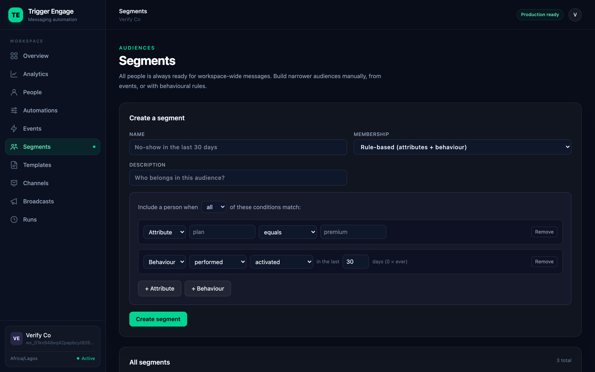

# Segments

A segment is a reusable audience with a public id like `seg_01hxyz...`. Segments power one-time
**broadcasts** — a broadcast snapshots the segment's members at send time and sends to that
point-in-time list. There are four kinds, differing only in how membership is decided.

## The four types

| Type | Membership changes when… | Editable via API? | Recomputes itself? |
|---|---|---|---|
| `all` | a profile is created | No (`422`) | Always current |
| `manual` | you add/remove people yourself | **Yes** — `PUT`/`DELETE` | No |
| `event` | a bound event fires for a person | No (`422`) | No — append-only on the event |
| `rule` | data changes or time passes | No (`422`) | **Yes** — continuously |

The membership source is recorded per person as `system`, `api`, `event`, or `rule`.

## Managing segments

Open **Segments → Manage** to inspect a segment's paginated member list, search its members,
rename it, update its description, or delete it. Manual segments also show a workspace profile
search with direct **Add** and **Remove** actions. Event, rule, and All people membership remains
read-only because the engine owns it.

All people cannot be renamed or deleted. Other segments can be deleted until they are referenced
by broadcast history; referenced segments are retained so historical audience reporting remains
accurate.

## All people

Every workspace receives one protected **All people** segment automatically. Installation
backfills existing identified and anonymous profiles, and each new profile is added with source
`system`. Use it for workspace-wide broadcasts; it cannot be renamed through the segment editor
or changed through the membership API.

## Manual segments

Membership is managed explicitly. Use the [API](../API.md#segment-membership) or SDK to add and
remove identified people:

```php
TriggerEngage::addToSegment('seg_01hxyz...', 'user-42');
TriggerEngage::removeFromSegment('seg_01hxyz...', 'user-42');
```

```bash
curl --user "$WS:$KEY" -X PUT \
  https://engage.example.com/api/v1/segments/seg_01hxyz.../people/user-42
```

`DELETE` on the same path removes them. Membership source is recorded as `api`.

## Event segments

Choose membership **"Automatic from an event"** in the dashboard and bind the segment to one
event. A person is added **idempotently** the moment that event fires for them — no rule, no
recompute, just append-on-event. Source is `event`.

Because the server owns membership, the manual-membership API rejects edits to an event segment
with `422`.

## Rule segments (behavioural)

A rule segment is a boolean rule over **attributes** and **behaviour** that **recomputes itself**
as data changes and time passes. You create and edit it on the dashboard's **Segments** page, and
its source is `rule`. Like event segments, it rejects manual-membership API edits with `422`.



### The rule shape

A rule is one boolean group: a `match` mode and a list of `conditions`.

```jsonc
{
  "match": "all",            // "all" = AND, "any" = OR
  "conditions": [
    // Attribute condition — a property or identity column
    { "kind": "attribute", "field": "plan", "operator": "equals", "value": "premium" },

    // Behaviour condition — did / did not perform an event in a window
    { "kind": "event", "event_id": "session_booked", "performed": true, "within_days": 30 }
  ]
}
```

In the UI this reads as *"Include a person when [all|any] of these conditions match,"* with
**+ Attribute** and **+ Behaviour** buttons to append conditions.

The `conditions` list must hold at least one entry — an **empty list matches nobody**.

### Attribute conditions

`{ "kind": "attribute", "field", "operator", "value" }`. `field` is a property name (e.g. `plan`)
or an identity column (`email`, `phone`, `external_id`).

| Operator | Meaning |
|---|---|
| `equals` / `not_equals` | Exact match / no match |
| `gt` / `gte` / `lt` / `lte` | Numeric or ordinal comparison |
| `contains` | Substring / membership |
| `exists` / `not_exists` | Attribute is present / absent (no `value`) |

`exists` and `not_exists` take no `value`. Note that `not_equals` also matches people who are
**missing that attribute entirely**, not only those whose value differs.

### Behaviour conditions

`{ "kind": "event", "event_id", "performed", "within_days" }`.

- `event_id` — the **numeric id** of the event. You never type this: the dashboard shows event
  names and stores their ids, so the readable names in the examples below stand in for those ids.
- `performed` — `true` (did) or `false` (did not).
- `within_days` — a number of days; `0` means **ever**.

So `performed: true, within_days: 30` is *"performed the event in the last 30 days,"* and
`performed: false, within_days: 14` is *"did NOT perform the event in the last 14 days."*

### Worked examples

**Booked but not attended in 30 days** (no-shows) — match `all`: they booked recently, but have
no attendance in the same window.

```jsonc
{
  "match": "all",
  "conditions": [
    { "kind": "event", "event_id": "session_booked",   "performed": true,  "within_days": 30 },
    { "kind": "event", "event_id": "session_attended", "performed": false, "within_days": 30 }
  ]
}
```

**Premium plan** — a single attribute check.

```jsonc
{
  "match": "all",
  "conditions": [
    { "kind": "attribute", "field": "plan", "operator": "equals", "value": "premium" }
  ]
}
```

**Inactive 14 days** — a purely time-based rule: no `app_open` in the window.

```jsonc
{
  "match": "all",
  "conditions": [
    { "kind": "event", "event_id": "app_open", "performed": false, "within_days": 14 }
  ]
}
```

## How rule membership stays current

Rule membership is **materialized** into the segment, so broadcasts and everything downstream work
exactly as they do for manual and event segments. It updates three ways:

1. **Incrementally, per person, on a new event** — when an event arrives for someone, their
   membership in relevant rule segments is re-evaluated.
2. **Incrementally, per person, on a profile change** — when their properties change, the same
   re-evaluation runs.
3. **A periodic scheduler sweep** — `engage:tick` runs every minute and recomputes segments that
   have gone stale. This is what catches purely **time-based** drift like *inactive 14 days*, where
   membership changes only because time passed, with no new event or profile edit.

On creation and on **every rule edit**, membership is recomputed immediately. Rule segments can be
edited after creation from the dashboard; editing recomputes membership.

## Segments and broadcasts

A **broadcast** (in the dashboard) sends a one-time message to a **point-in-time snapshot** of a
segment's members — see the [Broadcast concept](../CONCEPTS.md#broadcast). Later membership changes,
whatever the segment type, never alter an already-sent broadcast.

## Next

- **Broadcasts** — send a one-time campaign to a segment snapshot (dashboard).
- [Analytics](./analytics.md) — see how sends and journeys performed.
- [HTTP API reference](../API.md#segment-membership) — manual-membership endpoints.
